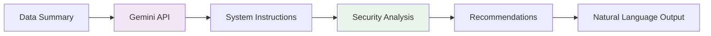

# 🛡️ LEAP Security Dashboard - Architecture & Data Flow

## 📋 Overview

LEAP Security Dashboard adalah platform analitik keamanan khusus untuk LKP LEAP yang mengintegrasikan Google Sheets sebagai data source utama dengan AI-powered security analysis menggunakan Google Gemini.

## 🏗️ Project Architecture

### Core Structure

| Path                      | Type             | Description                        | Dependencies          | Output                              |
| ------------------------- | ---------------- | ---------------------------------- | --------------------- | ----------------------------------- |
| `app.py`                  | 🎯 Main App      | Streamlit dashboard entrypoint     | `core.*`, `streamlit` | Interactive web dashboard           |
| `config/settings.py`      | ⚙️ Config        | Google Sheets & GCP configuration  | -                     | App settings & secrets              |
| `core/data_pipeline.py`   | 🔄 Data Pipeline | Data loading, cleaning, processing | `gspread`, `pandas`   | Clean DataFrames                    |
| `core/llm_analyzer.py`    | 🤖 AI Engine     | Gemini AI security analysis        | `google-generativeai` | Security insights & recommendations |
| `core/charts.py`          | 📊 Visualization | Plotly interactive charts          | `plotly`              | Interactive visualizations          |
| `styles/style.css`        | 🎨 Styling       | Custom dashboard CSS               | -                     | UI styling                          |
| `.streamlit/secrets.toml` | 🔐 Secrets       | API keys & credentials             | -                     | Secure configuration                |

## 🔄 Data Flow Pipeline

```mermaid
graph TD
    A[Google Sheets] --> B[authenticate_google_sheets()]
    B --> C[_open_spreadsheet()]
    C --> D[get_sheet_data()]
    D --> E[load_sheet_to_dataframe()]
    E --> F[_apply_data_types()]
    F --> G[clean_all_data()]
    G --> H[get_data_quality_report()]
    H --> I[analyze_security()]
    I --> J[create_attendance_chart()]
    J --> K[Streamlit Dashboard]

    style A fill:#e1f5fe
    style I fill:#f3e5f5
    style K fill:#e8f5e8
```

### Detailed Flow Steps

1. **🔐 Authentication**: Connect to Google Sheets API using service account
2. **📄 Spreadsheet Access**: Open spreadsheet by URL or ID
3. **📊 Data Extraction**: Fetch all data from configured sheets
4. **🔄 Data Loading**: Convert to pandas DataFrames with proper structure
5. **🧹 Data Cleaning**: Apply type conversion, error handling, missing value treatment
6. **📈 Quality Analysis**: Generate comprehensive data quality reports
7. **🤖 AI Analysis**: Security analysis using Google Gemini AI
8. **📊 Visualization**: Create interactive charts and dashboards
9. **🌐 Web Interface**: Serve via Streamlit with real-time updates

## 📁 Data Sources & Structure

### Google Sheets Integration

| Sheet Name       | Purpose             | Key Columns                 | Data Types              |
| ---------------- | ------------------- | --------------------------- | ----------------------- |
| `DATA_MASTER`    | Master student data | nama, rombel, kelas         | string, string          |
| `DATA_ABSENSI`   | Attendance records  | nama, tanggal, hadir        | string, date, boolean   |
| `DATA_NILAI`     | Academic scores     | nama, mata_pelajaran, nilai | string, string, numeric |
| `DATA_PERTEMUAN` | Class sessions      | tanggal, materi, pengajar   | date, string, string    |

### Data Processing Stages

#### Stage 1: Raw Data Loading

```python
# From core/data_pipeline.py
def load_all_data() -> Dict[str, pd.DataFrame]:
    # Authenticate with Google Sheets
    # Open spreadsheet
    # Extract all sheets
    # Return raw DataFrames
```

#### Stage 2: Data Cleaning Pipeline

```python
# From core/data_pipeline.py
def clean_all_data(dataframes: Dict[str, pd.DataFrame]):
    # Apply Google Sheets error cleaning
    # Apply sheet-specific cleaning (attendance, master, scores)
    # Handle missing values
    # Remove empty rows
    # Return cleaned DataFrames
```

#### Stage 3: AI Security Analysis

```python
# From core/llm_analyzer.py
def analyze_security(dataframes: Dict[str, pd.DataFrame]):
    # Prepare data summary for AI
    # Call Google Gemini API
    # Generate security insights
    # Return analysis report
```

## 🔧 Configuration Management

### Settings Hierarchy

```
.streamlit/secrets.toml (highest priority)
         ↓
config/settings.py (defaults)
         ↓
Hardcoded defaults (fallback)
```

### Key Configuration Files

#### `.streamlit/secrets.toml`

```toml
# AI Configuration
GEMINI_API_KEY = "AIzaSy..."

# Data Source Configuration
spreadsheet_url = "https://docs.google.com/spreadsheets/d/.../edit"
sheet_names = ["DATA_MASTER", "DATA_ABSENSI", "DATA_NILAI"]

# GCP Credentials
[gcp_service_account_json]
type = "service_account"
project_id = "dashboard-leap"
private_key = "..."
client_email = "..."
```

#### `config/settings.py`

```python
# Default configurations
SPREADSHEET_URL = ""
SERVICE_ACCOUNT_PATH = "service_account.json"
SHEET_NAMES = ['DATA_MASTER', 'DATA_ABSENSI', 'DATA_NILAI']

# AI Analysis Configuration
SECURITY_ANALYSIS_CONFIG = {
    'system_instruction': "...",
    'temperature': 0.3
}

# Data Type Mappings
DATA_TYPE_MAPPINGS = {
    'boolean_columns': ['hadir', 'present'],
    'numeric_columns': ['nilai', 'score'],
    'date_columns': ['tanggal', 'date']
}
```

## 🤖 AI Integration Architecture

### Gemini AI Pipeline



### AI Features

| Component                             | Function          | Input                  | Output                  |
| ------------------------------------- | ----------------- | ---------------------- | ----------------------- |
| `prepare_data_summary()`              | Data aggregation  | DataFrames             | Structured text summary |
| `analyze_security()`                  | AI analysis       | Data summary + context | Security insights       |
| `generate_security_recommendations()` | Actionable advice | Analysis results       | Recommendation list     |

## 📊 Visualization Pipeline

### Chart Generation Flow

```mermaid
graph TD
    A[Clean DataFrames] --> B[Chart Functions]
    B --> C[Plotly Figures]
    C --> D[Streamlit Display]

    B --> E[create_attendance_chart()]
    B --> F[create_score_distribution()]
    B --> G[create_overview_metrics_chart()]
```

### Interactive Features

- **Real-time Updates**: Data refreshes every 5 minutes
- **Caching Strategy**: `@st.cache_data(ttl=300)` for performance
- **Responsive Design**: Mobile-friendly layouts
- **Expandable Sections**: Detailed analysis in expanders

## 🔄 Caching & Performance

### Cache Strategy

| Component                 | Cache TTL  | Purpose      | Update Trigger |
| ------------------------- | ---------- | ------------ | -------------- |
| `load_pipeline_data()`    | 5 minutes  | Data loading | Manual refresh |
| `get_security_analysis()` | 10 minutes | AI analysis  | Data changes   |
| Static assets             | Session    | CSS, config  | App restart    |

### Performance Optimizations

- **Lazy Loading**: Data loaded only when needed
- **Background Processing**: AI analysis cached separately
- **Memory Management**: DataFrames cleaned after processing
- **API Rate Limiting**: Respect Google APIs quotas

## 🛡️ Security Architecture

### Data Protection Layers

1. **Transport Security**: HTTPS for all API calls
2. **Credential Management**: Secrets stored securely in Streamlit
3. **Access Control**: Service account with minimal permissions
4. **Data Sanitization**: Input validation and cleaning
5. **Error Handling**: Secure error messages without data leakage

### AI Security Features

- **Context Isolation**: AI analysis scoped to LKP LEAP data
- **Prompt Engineering**: Specialized security analysis prompts
- **Output Filtering**: Sanitized AI responses
- **Audit Logging**: Analysis activities tracked

## 🚀 Deployment Considerations

### Development Environment

- Local Streamlit server
- Hot reload for development
- Debug mode enabled

### Production Deployment

- Streamlit Cloud or dedicated server
- Environment variables for secrets
- Monitoring and logging
- Backup strategies

### Scaling Considerations

- API rate limit management
- Data size optimization
- Concurrent user handling
- Cache invalidation strategies

## 🔧 Maintenance & Monitoring

### Health Checks

- Google Sheets API connectivity
- Gemini AI API availability
- Data loading success rates
- Memory usage monitoring

### Error Recovery

- Graceful degradation on API failures
- Fallback to cached data
- User-friendly error messages
- Automatic retry mechanisms

---

**📊 This architecture ensures reliable, secure, and performant security analysis for LKP LEAP data operations.**
