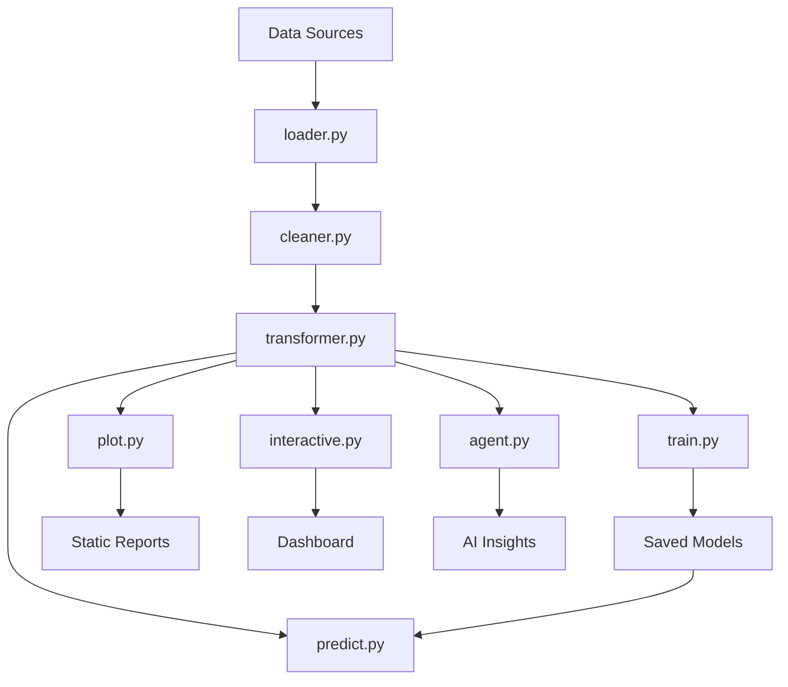

# Dashboard Leap - Project Structure & Flow

## Overview

Dashboard Leap adalah platform analitik data komprehensif yang menyediakan pipeline end-to-end dari data ingestion hingga AI-powered insights.

## Project Structure

| Path                 | Type | Description                       | Dependencies          | Output                     |
| -------------------- | ---- | --------------------------------- | --------------------- | -------------------------- |
| `app.py`             | File | Streamlit application entrypoint  | `core.*`, `streamlit` | Interactive web dashboard  |
| `config/settings.py` | File | Konfigurasi Google Sheets dan GCP | -                     | Pengaturan aplikasi        |
| `styles/style.css`   | File | Custom CSS untuk dashboard        | -                     | Styling dashboard          |
| `requirements.txt`   | File | Dependencies Python               | -                     | Package requirements       |
| `README.md`          | File | Dokumentasi proyek                | -                     | Project documentation      |
| `.gitignore`         | File | Git ignore rules                  | -                     | Version control exclusions |

## Core Modules (`src/`)

### API Module (`src/api/`)

| File       | Function                            | Input                     | Output         | Dependencies     |
| ---------- | ----------------------------------- | ------------------------- | -------------- | ---------------- |
| `fetch.py` | Fetching data dari external sources | API endpoints, DB queries | JSON/dict data | `requests`, `os` |

### Data Processing (`src/data/`)

| File             | Function                               | Input                     | Output                | Key Features                         |
| ---------------- | -------------------------------------- | ------------------------- | --------------------- | ------------------------------------ |
| `loader.py`      | Load data dari berbagai sumber         | File paths, API endpoints | pandas.DataFrame      | CSV, Excel, API, Database            |
| `cleaner.py`     | Data cleaning dan preprocessing        | Raw DataFrame             | Clean DataFrame       | Missing values, duplicates, outliers |
| `transformer.py` | Feature engineering dan transformation | Clean DataFrame           | Transformed DataFrame | Scaling, encoding, feature creation  |

### Machine Learning (`src/models/`)

| File         | Function                | Input                        | Output                  | Algorithms                       |
| ------------ | ----------------------- | ---------------------------- | ----------------------- | -------------------------------- |
| `train.py`   | Model training pipeline | Processed DataFrame + target | Trained model + metrics | RandomForest, LogisticRegression |
| `predict.py` | Model prediction        | New data + trained model     | Predictions             | Batch/single prediction          |

### Visualization (`src/visualization/`)

| File             | Function                       | Input     | Output         | Libraries           |
| ---------------- | ------------------------------ | --------- | -------------- | ------------------- |
| `plot.py`        | Static data visualizations     | DataFrame | PNG/JPG plots  | matplotlib, seaborn |
| `interactive.py` | Interactive web visualizations | DataFrame | Plotly figures | plotly              |

### AI Integration (`src/llm/`)

| File       | Function                  | Input                       | Output      | AI Features               |
| ---------- | ------------------------- | --------------------------- | ----------- | ------------------------- |
| `agent.py` | LLM-powered data analysis | User queries + data context | AI insights | Google Gemini integration |

## Data Flow Pipeline



## Data Directory Structure

Data folders are not required for this Streamlit dashboard. All data is loaded from Google Sheets via `config/settings.py` and `.streamlit/secrets.toml`.

| Directory | Purpose       | Content Type | Access Pattern |
| --------- | ------------- | ------------ | -------------- |
| `styles/` | Dashboard CSS | CSS          | UI styling     |

## Reports & Outputs

| Directory | Purpose    | Generated By | Content Type |
| --------- | ---------- | ------------ | ------------ |
| `styles/` | Custom CSS | CSS          | Optional     |

## Configuration Files

| File                      | Purpose                        | Format | Required |
| ------------------------- | ------------------------------ | ------ | -------- |
| `config/settings.py`      | App and data source config     | Python | Yes      |
| `.streamlit/secrets.toml` | Secret overrides for Streamlit | TOML   | Optional |
| `pyrightconfig.json`      | Python type checking           | JSON   | Optional |

## Environment & Dependencies

| Component          | Purpose                    | Location   | Management      |
| ------------------ | -------------------------- | ---------- | --------------- |
| `venv/`            | Python virtual environment | Root level | Manual creation |
| `requirements.txt` | Python packages            | Root level | pip install     |
| `.gitignore`       | Version control exclusions | Root level | Git             |

## Execution Flow

### 1. Setup Phase

```
requirements.txt → pip install → Virtual environment ready
config/settings.py / .streamlit/secrets.toml → API keys configured → External connections ready
```

### 2. Data Processing Phase

```
Raw Data → loader.py → cleaner.py → transformer.py → Processed Data
```

### 3. Model Development Phase

```
Processed Data → train.py → Model training → Model evaluation → Saved model
```

### 4. Inference Phase

```
New Data → predict.py → Model predictions → Results
```

### 5. Visualization Phase

```
Processed Data → plot.py/interactive.py → Static/Interactive visualizations
```

### 6. AI Analysis Phase

```
Data + User Query → agent.py → LLM analysis → Insights
```

### 7. Dashboard Phase

```
All components → app.py → Streamlit dashboard → User interaction
```

## Key Integration Points

| Component               | Integrates With                   | Purpose                   |
| ----------------------- | --------------------------------- | ------------------------- |
| `app.py`                | `core/`, `config/`                | Streamlit dashboard entry |
| `core/data_pipeline.py` | `core/llm_analyzer.py`            | Load and clean Sheet data |
| `core/llm_analyzer.py`  | `app.py`                          | AI security analysis      |
| `core/charts.py`        | `app.py`                          | Visualization helpers     |
| `config/settings.py`    | `app.py`, `core/data_pipeline.py` | Sheet/GCP configuration   |

## Error Handling & Logging

| Component        | Error Types                   | Handling Method                  |
| ---------------- | ----------------------------- | -------------------------------- |
| `loader.py`      | File not found, format errors | Try/except with fallbacks        |
| `cleaner.py`     | Data quality issues           | Configurable cleaning strategies |
| `transformer.py` | Transformation failures       | Graceful degradation             |
| `train.py`       | Model convergence issues      | Alternative algorithms           |
| `predict.py`     | Model loading errors          | Fallback predictions             |
| `agent.py`       | API failures                  | Offline mode fallbacks           |

## Performance Considerations

| Component        | Optimization                     | Monitoring               |
| ---------------- | -------------------------------- | ------------------------ |
| `loader.py`      | Chunked reading for large files  | Memory usage tracking    |
| `transformer.py` | Vectorized operations            | Processing time logs     |
| `train.py`       | Cross-validation, early stopping | Training metrics         |
| `predict.py`     | Batch processing                 | Prediction latency       |
| `plot.py`        | Efficient rendering              | Plot generation time     |
| `interactive.py` | Lazy loading                     | Dashboard responsiveness |

## Security Considerations

| Component            | Security Aspects        | Implementation              |
| -------------------- | ----------------------- | --------------------------- |
| `config/settings.py` | API keys, credentials   | Environment variables       |
| `fetch.py`           | API authentication      | Secure headers, tokens      |
| `agent.py`           | LLM API access          | Key rotation, rate limiting |
| Data files           | Sensitive data handling | Access controls, encryption |

## Maintenance & Updates

| Component            | Update Frequency           | Version Control          |
| -------------------- | -------------------------- | ------------------------ |
| `requirements.txt`   | As needed for new features | Semantic versioning      |
| `config/settings.py` | Environment changes        | Git-tracked with secrets |
| Models               | Data distribution changes  | Model versioning         |
| `README.md`          | Feature additions          | Documentation updates    |
| Tests                | Code changes               | Automated testing        |

## Troubleshooting Guide

| Issue                 | Likely Cause         | Solution                                                 |
| --------------------- | -------------------- | -------------------------------------------------------- |
| Import errors         | Missing dependencies | `pip install -r requirements.txt`                        |
| Data loading fails    | Wrong file paths     | Check `config/settings.py` and `.streamlit/secrets.toml` |
| Model training slow   | Large dataset        | Reduce data size or use sampling                         |
| Dashboard not loading | Port conflicts       | Change Streamlit port                                    |
| LLM not responding    | API key issues       | Check `config/settings.py` or `.streamlit/secrets.toml`  |
| Memory errors         | Large datasets       | Use chunked processing                                   |

## Future Enhancements

| Area          | Potential Improvements                    |
| ------------- | ----------------------------------------- |
| Data Sources  | Add cloud storage, real-time streams      |
| ML Models     | Deep learning, ensemble methods           |
| Visualization | 3D plots, real-time dashboards            |
| AI Features   | Multi-modal analysis, automated reporting |
| Performance   | Distributed processing, GPU acceleration  |
| Security      | End-to-end encryption, audit logging      |
