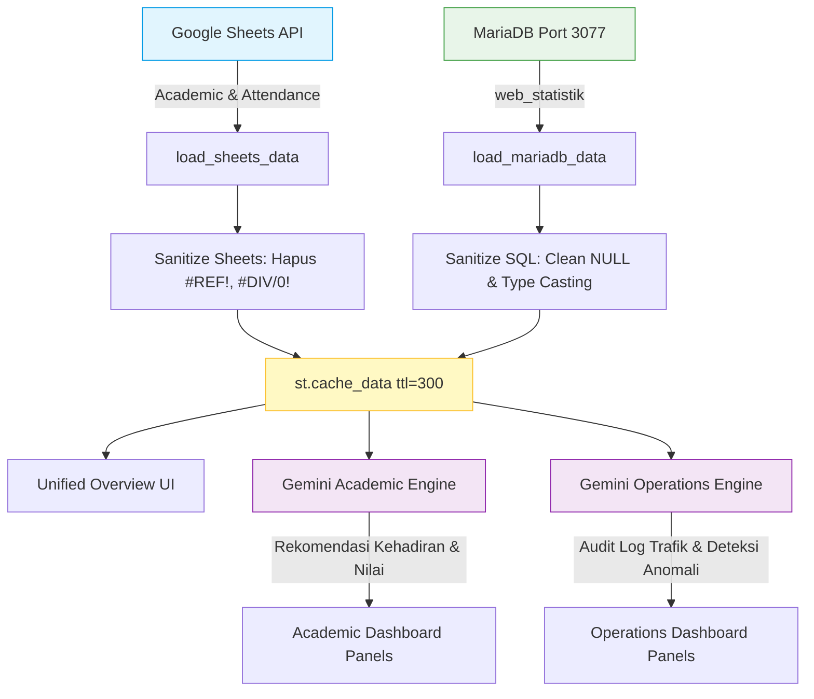
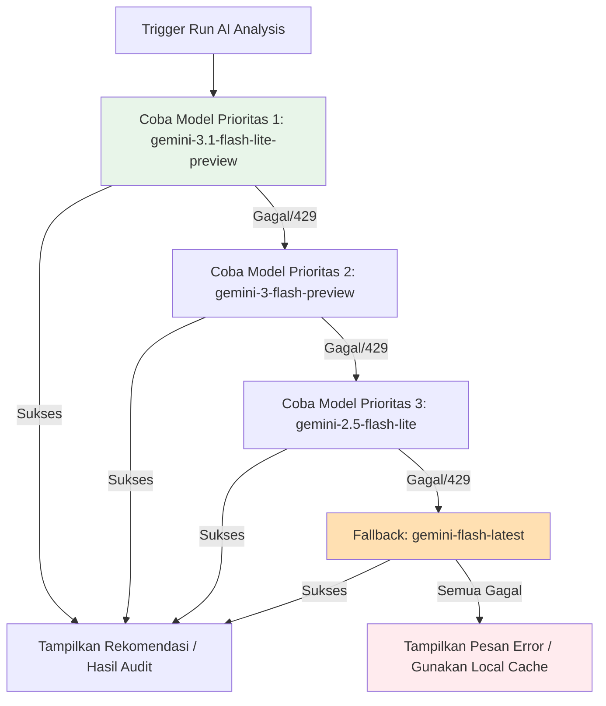

# 🛡️ EduDecision AI V2 - Architecture & Data Flow

Dokumen ini mendeskripsikan arsitektur sistem, alur pemrosesan data hibrida (*Dual-Input Data Pipeline*), mekanisme orkestrasi AI (*Dual Engines & Failover*), serta detail visualisasi antarmuka dalam **EduDecision AI V2**.

---

## 🏗️ Struktur Arsitektur Sistem

Sistem ini didesain secara modular untuk berjalan stabil pada baseline perangkat keras lokal terbatas (8GB RAM RAM Baseline) dengan membagi fungsionalitas ke beberapa komponen utama:

```
[Google Sheets API]  ------ (Academic Stream) ------> [Gemini Academic Engine]
                                                                |
                                                                v
                                                       [Streamlit App Core] <--- [Genesis CSS Styling]
                                                                ^
                                                                |
[MariaDB (Port 3077)] ------ (Operations Stream) ------> [Gemini Operations Engine]
```

### Pemetaan File & Modul

| Berkas / Modul | Peran | Alur Ketergantungan | Hasil Keluaran |
| :--- | :--- | :--- | :--- |
| `app.py` | 🎯 Main Entrypoint | `core.*`, `styles/style.css` | Antarmuka pengguna (*Dashboard UI*) |
| `config/settings.py`| ⚙️ Config Manager | `secrets.toml`, Environment variables | Parameter koneksi & setup global |
| `core/data_pipeline.py`| 🔄 Data Pipeline | `mysql-connector`, `gspread`, `pandas` | DataFrames bersih & Mock Data Simulator |
| `core/llm_analyzer.py`| 🤖 AI Orchestrator | `google-generativeai`, Failover loop | Insight Akademik & Audit Operasional Web |
| `core/charts.py` | 📊 Visualization | `plotly` | Grafik interaktif (Plotly Figures) |
| `styles/style.css` | 🎨 Visual Styles | Terbaca oleh `app.py` via HTML Markdown | Estetika visual *Genesis Design* & MFA |

---

## 🔄 Dual-Input Data Flow Pipeline

Sistem membagi penarikan data menjadi dua aliran terisolasi (*read-only*) untuk menjamin keamanan dan performa memori.


```mermaid
graph TD
    %% Input Sources
    A[Google Sheets API] -->|Academic & Attendance| B[load_sheets_data]
    C[MariaDB Port 3077] -->|web_statistik| D[load_mariadb_data]

    %% Preprocessing
    B --> E[Sanitize Sheets: Hapus #REF!, #DIV/0!]
    D --> F[Sanitize SQL: Clean NULL & Type Casting]
    
    %% Cache & Streamlit Core
    E --> G[st.cache_data ttl=300]
    F --> G
    
    %% Engine Processing
    G --> H[Unified Overview UI]
    G --> I[Gemini Academic Engine]
    G --> J[Gemini Operations Engine]
    
    %% AI Output Generation
    I -->|Rekomendasi Kehadiran & Nilai| K[Academic Dashboard Panels]
    J -->|Audit Log Trafik & Deteksi Anomali| L[Operations Dashboard Panels]

    style A fill:#e1f5fe,stroke:#039be5
    style C fill:#e8f5e9,stroke:#43a047
    style G fill:#fff9c4,stroke:#fbc02d
    style I fill:#f3e5f5,stroke:#8e24aa
    style J fill:#f3e5f5,stroke:#8e24aa
```

### Tahapan Aliran Data:

1. **Inisiasi Kredensial**: `config/settings.py` memuat kredensial dari `.streamlit/secrets.toml` untuk port MariaDB `3077` dan Service Account JSON GCP.
2. **Koneksi & Ekstraksi**:
   * **Academic Stream**: `gspread` membuka spreadsheet berdasarkan ID dan membaca lembar `DATA_SISWA`, `DATA_ABSENSI`, `DATA_NILAI`, `DATA_KELUAR`, `DATA_OVERVIEW`.
   * **Operations Stream**: Konektor SQL MariaDB melakukan kueri pembacaan pada tabel `web_statistik`.
3. **Sanitasi Data**:
   * Mengonversi string rumus hancur (`#REF!`, `#VALUE!`, dll.) menjadi nilai kosong (`NaN`).
   * Melakukan *type-downcasting* untuk kolom numerik dan boolean guna menghemat penggunaan memori RAM.
4. **Optimasi Memori (Caching)**: Data yang berhasil dibersihkan disimpan sementara menggunakan dekorator Streamlit `@st.cache_data(ttl=300)` untuk mencegah kueri berulang yang berat setiap halaman disegarkan (*refreshed*).
5. **On-Demand AI Execution**: Analisis kecerdasan buatan dijalankan hanya saat tombol **"Run AI Analysis"** diklik secara manual oleh pengguna untuk menekan biaya konsumsi token API.

---

## 🤖 AI Orchestration & Multi-Model Failover

Untuk mengatasi kendala kegagalan koneksi API, keterbatasan kuota akun gratis, dan error status **HTTP 429 (Rate Limit)**, sistem menerapkan *failover registry loop* sekuensial.


```mermaid
graph TD
    A[Trigger Run AI Analysis] --> B[Coba Model Prioritas 1: gemini-3.1-flash-lite-preview]
    B -->|Sukses| C[Tampilkan Rekomendasi / Hasil Audit]
    B -->|Gagal/429| D[Coba Model Prioritas 2: gemini-3-flash-preview]
    D -->|Sukses| C
    D -->|Gagal/429| E[Coba Model Prioritas 3: gemini-2.5-flash-lite]
    E -->|Sukses| C
    E -->|Gagal/429| F[Fallback: gemini-flash-latest]
    F -->|Sukses| C
    F -->|Semua Gagal| G[Tampilkan Pesan Error / Gunakan Local Cache]

    style B fill:#e8f5e9
    style F fill:#ffe0b2
    style G fill:#ffebee
```

### Konfigurasi Mesin AI:

* **Gemini Academic Engine**: Menggunakan instruksi sistem khusus untuk menganalisis data kehadiran dan nilai ujian. Fokus pada interpretasi tren retensi siswa (mitigasi *dropout*) dan merumuskan 5 rekomendasi pembinaan taktis.
* **Gemini Operations Engine**: Menggunakan instruksi sistem yang mengkhususkan diri pada audit jaringan dan keamanan siber. Menerima data log statistik web (`web_statistik`) dan fokus pada deteksi anomali akses (seperti percobaan *brute force*, scraping agresif, atau kegagalan respon server).

---

## 🎨 UI/UX Layout & Interaksi Pengguna (Genesis Design)

Antarmuka EduDecision AI V2 menerapkan gaya visual **Genesis Design** dengan detail interaksi sebagai berikut:

### 1. MFA Login Page
* Formulir login diposisikan di tengah layar dengan background netral terang (`#FAFAFA`) dan sudut membulat (`12px`).
* Responsivitas lebar kontainer dikontrol oleh CSS kustom:
  * Layar Desktop: `max-width: 850px`
  * Layar Tablet: `max-width: 680px`
  * Layar Mobile: `width: 100%`

### 2. Dashboard Sidebar Navigation
* Menggunakan `st.sidebar.radio` untuk navigasi antar halaman utama secara langsung.
* Menu terdiri dari:
  1. **Unified Overview**: Menampilkan KPI gabungan dan grafik visualisasi.
  2. **Academic Dashboard**: Modul khusus data Google Sheets + Gemini Academic Engine.
  3. **Operations Dashboard**: Modul khusus log MariaDB + Gemini Operations Engine.
* Tombol **Sign Out** diletakkan di bagian paling bawah sidebar menggunakan modifikasi CSS kustom untuk memisahkan alur keluar secara logis.

### 3. Ekspor Laporan
* Pembuatan tombol unduh lokal pada panel rekomendasi AI.
* HTML/CSS pada sisi klien memicu `html2canvas` untuk menangkap elemen visual dashboard dan menyimpannya sebagai file `.png` langsung pada perangkat pengguna tanpa melakukan penyimpanan di sisi server.
